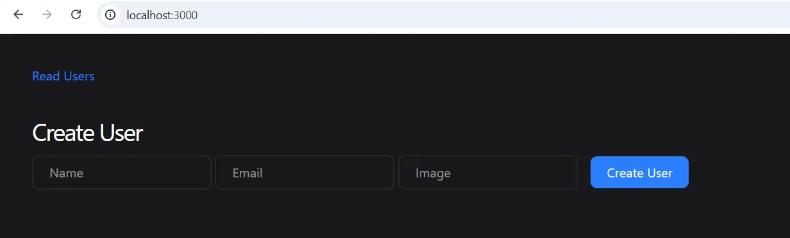
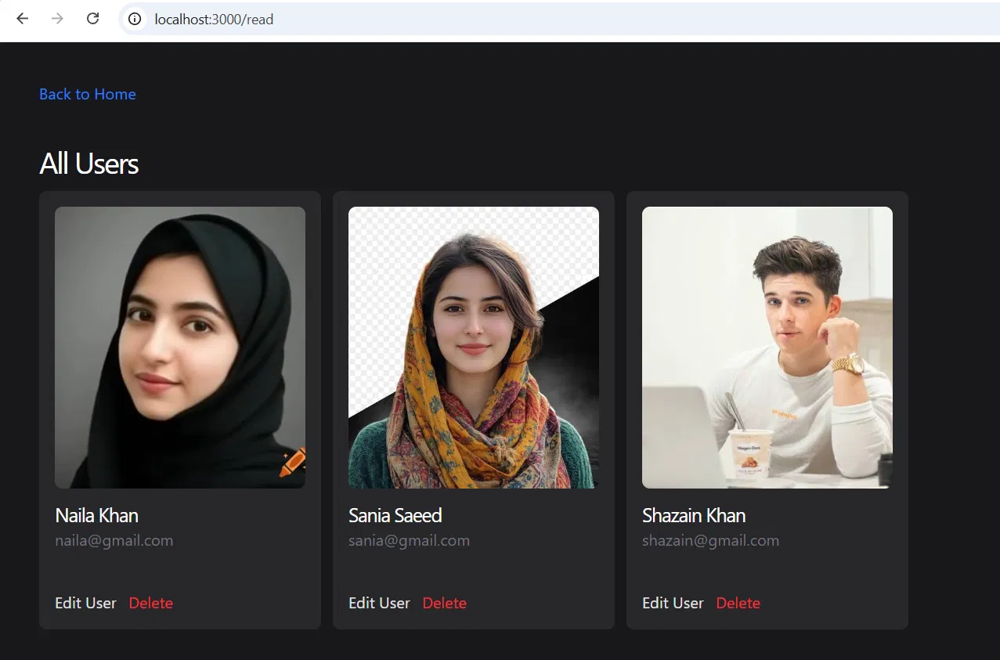
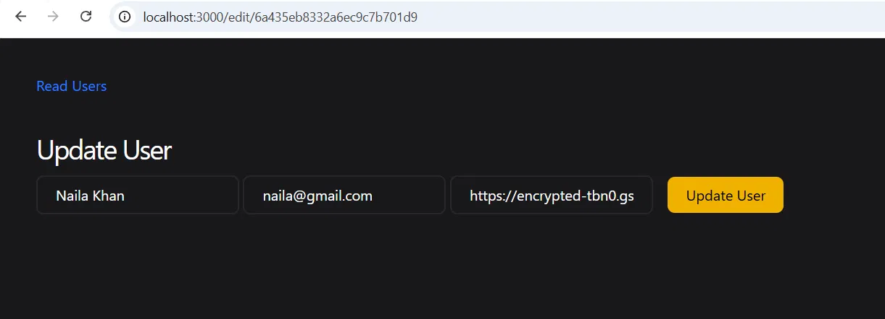

# Mongoose CRUD User App

A full CRUD (Create, Read, Update, Delete) user management application built with Node.js, Express.js, EJS, and MongoDB (via Mongoose). Users can be created, viewed, edited, and deleted through a styled web interface.

## Features

- **Create** new users with name, email, and a profile image URL
- **Read** all users in a responsive card layout
- **Update** existing user details through a pre-filled edit form
- **Delete** users from the database
- Server-side rendering with EJS
- Styled with Tailwind CSS

## Tech Stack

- **Backend:** Node.js, Express.js
- **Database:** MongoDB with Mongoose ODM
- **Templating:** EJS
- **Styling:** Tailwind CSS

## Screenshots

### Create User


### All Users


### Edit User


## Routes

| Method | Route | Description |
|--------|-------|-------------|
| GET | `/` | Render create user form |
| POST | `/create` | Create a new user |
| GET | `/read` | List all users |
| GET | `/edit/:userid` | Render edit form for a specific user |
| POST | `/update/:userid` | Update a specific user |
| GET | `/delete/:id` | Delete a specific user |

## Known Limitations

This project was built primarily to practice CRUD operations with Express and Mongoose, so some production-level practices are intentionally incomplete for now:

- **Delete uses a GET route** instead of a proper DELETE request — a known issue, fix in progress (plain HTML links can't send DELETE requests, so this needs a small JS `fetch()` call to do correctly).
- **Update uses POST instead of PUT** — a common workaround since standard HTML forms don't support PUT directly.
- **No error handling (try/catch)** on database operations yet.
- **No input validation** on the create/update forms.
- **No authentication** — anyone can create, edit, or delete any user.

## Run Locally

1. Clone the repository
```bash
   git clone https://github.com/SaniaSaeed2/mongoose-crud-user-app.git
   cd mongoose-crud-user-app
```

2. Install dependencies
```bash
   npm install
```

3. Make sure MongoDB is running locally on port `27017`

4. Start the server
```bash
   node app.js
```

5. Visit `http://localhost:3000`

## What I Learned

Building this project helped me understand how Express routes connect to Mongoose models for full CRUD functionality, how to pass data between routes and EJS views, and the importance of using correct HTTP methods for each operation (a mistake I caught and am actively fixing in this project).
